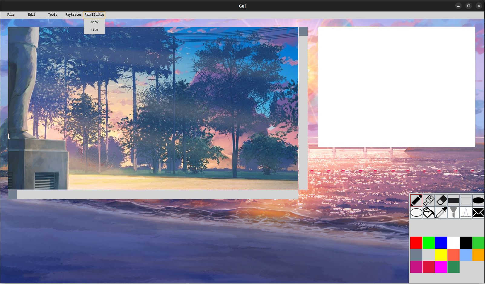
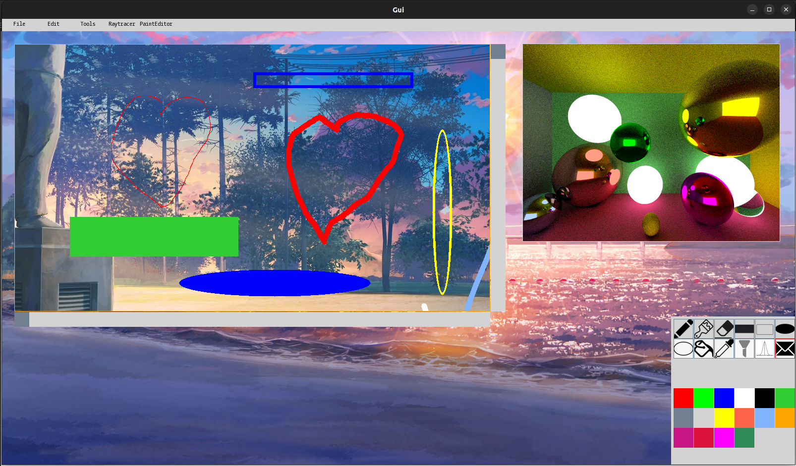
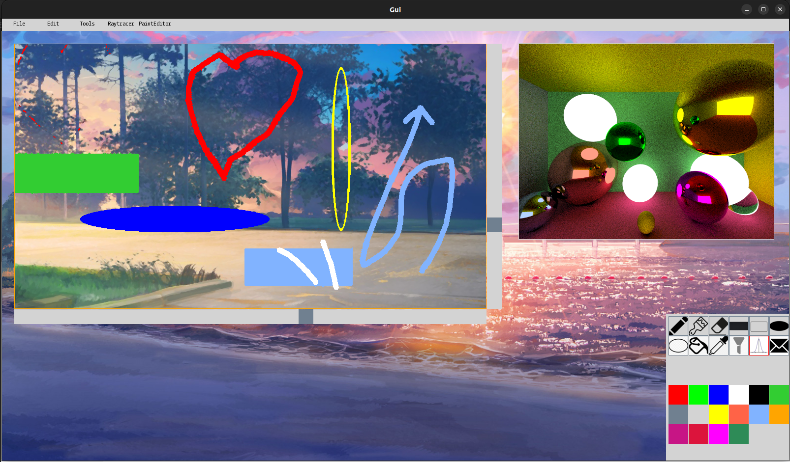
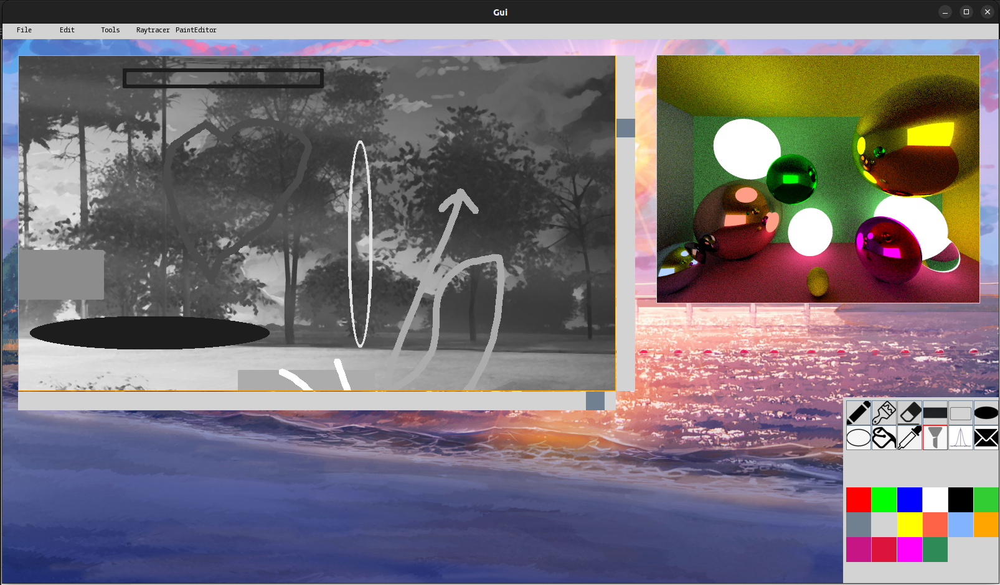

# GUI
The program is free-to-use for all kinds of developers.

***
## What does the project do
This is an example of simple graphics editor, written on C++ language. [SFML library](https://www.sfml-dev.org/) was used for
displaying all the elements of the program connected with graphics.

***
## Why is the project useful
Writing your own graphics editor is quite a complicated task. It requires designing the architecture of the program, choosing the way
of displaying its elements on the screen, trying to increase the performance in a way it is possible, guessing which interface would be
the most convenient both for users and modders, who might decide to bring new possibilities to the project.

***
## Structure
1. Main part:
      - background picture
      - raytracer window
      - menubar with buttons
      - canvas
      - tool panel with inbuilt tools (pencil, brush, eraser, shapes)
      - color panel
2. Plugins:
      - standard for plugins that was developed for compatibility of decisions from different modders (see [file](standard/tools.hpp))
      - some plugins made according to the standard and being linked dynamically during the work of program, their icons are always 
        the last in the tool panel (see [here](plugins) with __.so__ ending)

***
## How to launch
```c++
   $ git clone https://github.com/kirilliliych/GUI.git
   $ make
   $ make run
```

***
## Screenshots





***
## How can I help
I explicitly welcome any outside contributors. Use my mail: _ilichev.kv@phystech.edu_.

__A strong request__:
* Do not break the codestyle
* Do not destroy previous functionality with additions

***
## Where to ask questions
Use the mail mentioned earlier.
